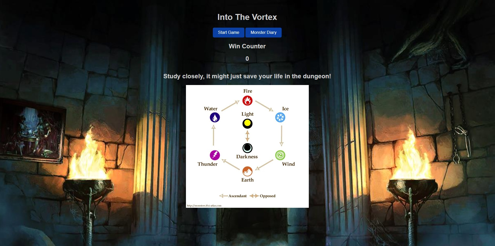
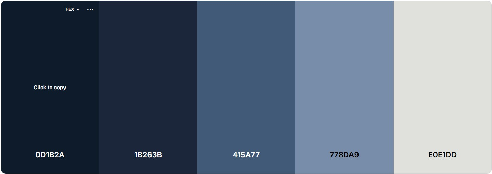
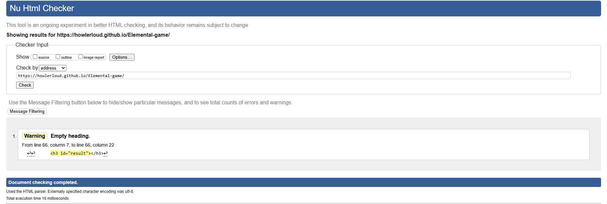
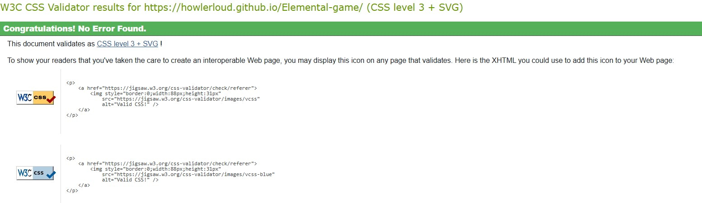
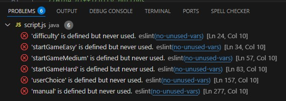

# Elemental-game
A game where the user has to face off against the machine by using elements to counter the attackers! The objective of the game is for the player to use all of his monster cards to defeat the random monster that is rotated in before the timer runs out.

<h1>Project Goals and User Experience</h1>
<h2>Project Goals</h2>
<ul>
  <li>The objective of this project is to make a fun fast paced card game that keeps the user thinking on the spot trying to memories a list of elements and their strengths and weaknesses.</li>
  <li>It has been designed to be easy to interact with, with 3 modes of difficulty.</li>
</ul>
<h2>User Stories</h2>
<ol>
  <li>As a first time user I want a clear and easy way to start the game. The game shows a start button on the front of the page followed by a choice of 3 difficulty buttons</li>
  <li>As a first time user I want to see how to beat the game. On the front page of the game a clear image shows what each element counters and what they get countered by and a instructions popup.</li>
  <li>As a first time user I want to know when I have won or lost the game. After beating all 6 enemy's the game comes up with a display showing I have beaten the dungeon. If I am defeated the game notifies me that I have been overrun.</li>
  <li>As a user I want the game to vary with difficulty giving me a reason to come back and improve. I can clearly see when I start the game there is 3 difficulty's to choose from that decrease the timer and increase the monster interval speed.</li>
  <li>As a user I want to be able to keep track of my wins. There is a win counter displayed at the top of the screen for me to keep track of my win streak.</li>
</ol>
<h2>Future Improvements</h2>
<ul>
  <li>Adding Light and Dark elements to the game on hard mode</li>
  <li>On easy mode give the user 2 lives with each element so they don't lose on first pick</li>
  <li>A win streak counter to track the users wins and add secret level after 10 wins</li>
</ul>
<h1>Design</h1>

The font Arial Sans Serif was used due to its great readability, modern aesthetic and accessibility

<h2>Colour Palette</h2>

<a href="https://coolors.co/">Coolers was used to generate the colour scheme.</a>

A dark theme was chosen to enhance the feeling of being in the dungeon adding to the user experience.

<h2>Wireframes</h2>

Below are the wireframes created for this project to give a good guide on how the finished product will look

<h3>The main menu for desktop</h3>

<h3>The main menu showcased on a mobile device</h3>

<h3>The game board shown on a desktop</h3>

<h3>The game board shown on a mobile device</h3>

<h3>The difficulty menu as shown on a desktop</h3>

<h3>The difficulty menu shown on a mobile device</h3>

<h1>Features</h1>

A choice of Easy, Medium or hard mode are given to the user to vary the difficulty of the game.

The game board shows a list of 6 elemental monsters that the user has control over and must use them to defeat the monsters in the dungeon

When a monster card is clicked it will either end the game telling the user they have been defeated if they picked incorrectly or flip and not be usable again if the user is correct.

A score counter at the top showing the user how many wins they have accrued and will reset if they lose a match.

<h1>Testing</h1>
<h2>Automated Testing</h2>

Automated Testing is the use of external software to check for errors in the code and to highlight them to be addressed.

<h2>Manual Testing</h2>

Manual Testing is the user/programmer checking code visually and comparing it to the results of the visual product. Check if buttons/links work, making sure code it outputting the correct response.

<h3>When manually testing these bugs appeared in my project</h3>
<ol>
  <li>When scaling the website for mobile the random element card started to overlap the rest of the game board causing collisions with the players card hand. Css was addressed to be the issue and the random element was given its own div to be targeted and allowed for better spacing.</li>
  <li>When a game end the counters picture on the main menu would disappear. This turned out to be an issue with the java script as the image was missed out when displaying the menu after a game. To fix this 
    "document.getElementById('element-counters').style.display = 'inline-block';" was added to make the counters image appear after the timer has hit 0 or the player has won/lost.</li>
  <li>Timer started to display as ${countdown} this was due to a change in the colons being used that caused the template literal to become a string.</li>
  <li>The count down timer would start to countdown quicker as time passed. This was due to a nested setInterval inside another setInterval which was constantly being called causing the timer to speed up every second.</li>
  <li>When winning or losing the start button would flicker on the screen no matter what part of the game you were on. This was due to another setInterval the kept calling the menu. It was changed to a setTimeout to stop the function from being called constantly.</li>
</ol>
<h3>
  
Currently there is only one thing i would like to change and that is the game will sometimes make the same random element appear more that once in a row. This would make the user think the game has bugged/stopped but in fact it has just rolled the same random element multiple times. I would like to make it so the current element is not part of the array when its in play.

<h2>Validator Testing</h2>

<h3>Html</h3>

W3C markup was used to validate my html and as shown it passed, it only addresses an empty heading that is filled when certain parameters are met on js.

<h3>CSS</h3>

W3 Jigsaw was used to check the css used in my project and has passed with no issues.

<h3>Java Script</h3>
<ul>
  <li>I used ES lint to validate my JS code. ES lint highlighted errors in my code and allowed me to find better ways to write the syntax. The code now contains no errors but does flag 6 variables that are defined but not used, this happens because the variables are used in the html and ES lint doesn't read html so it just flags as unused. </li>
</ul>

<h2>User Stories Testing</h2>
<h2>Future additions</h2>
<ul>
  <li>A secret level that appears after 5 consecutive wins that changes the monsters image to something new and jumbles up the element type wording so fire will look something like "RFIE" to throw the user off.</li>
  <li>A economy system with a shop after each win allowing the player to change the way the game is played for example "Boots of swiftness: Once used the player will retreat from the dungeon, keeping their win count but the boots will be destroyed."</li>
</ul>
<h2>Credits</h2>
<ul>
  <li>https://www.w3schools.com/js/js_htmldom_css.asp helping with styling of text using js.</li>
  <li>W3 Schools helped with a lot of js structure.</li>
  <li>Media for monsters. - https://finalfantasy.fandom.com/wiki/Final_Fantasy_XI_enemies </li>
  <li>Bro Code to help with js.</li>
</ul>

