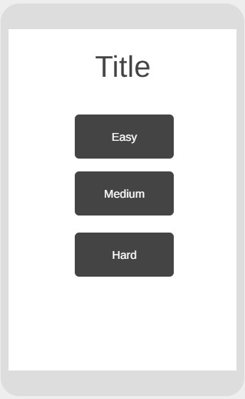

# Elemental-game
A game where the user has to face off against the machine by using elements to counter the attackers! The objective of the game is for the player to use all of his monster cards to defeat the random monster that is rotated in before the timer runs out.
w
<h1>Project Goals and User Experience</h1>
<h2>Project Goals</h2>
<ul>
  <li>The objective of this project is to make a fun facepaced card game that keeps the user thinking on the spot trying to memorise a list of elements and their strenghts and weaknesses.</li>
  <li>It has been designed to be easy to interact with with 3 modes of difficulty.</li>
</ul>
<h2>User Stories</h2>
<ol>
  <li>As a first time user I want a clear and easy way to start the game. The game shows a start button on the front of the page followed by a choice of 3 difficulty buttons</li>
  <li>As a first time user I want to see how to beat the game. On the front page of the game a clear image shows what each element counters and what they get countered by and a instructions popup.</li>
  <li>As a first time user I want to know when I have won or lost the game. After beating all 6 enemys the game comes up with a display showing I have beaten the dungeon. If I am defeated the game notifies me that I have been overrun.</li>
  <li>As a user I want the game to vary with difficulty giving me a reason to come back and improve. I can clearly see when I start the game there is 3 difficultys to choose from that decrease the timer and increase the monster interval speed.</li>
  <li>As a user I want to be able to keep track of my wins. There is a win counter displayed at the top of the screen for me to keep track of my win streak.</li>
</ol>
<h2>Future Improvements</h2>
<ul>
  <li>Adding Light and Dark elements to the game on hard mode</li>
  <li>On easy mode give the user 2 lives with each element so they dont lose on first pick</li>
  <li>A win streak counter to track the users wins and add secret level after 10 winsd</li>
</ul>
<h1>Design</h1>
<h2>Wireframes</h2>

Below are the wireframes created for this project to give a good guide on how the finished product will look

<h1>Features</h1>

The gameboard shows a list of 6 elemental monsters that the user has control over and must use them to defeat the monsters in the dungeon

When a monster card is clicked it will either end the game telling the user they have been defeated if they picked incorrectly or flip and not be usable again if the user is correct.

A choice of Easy, Medium or hard mode are given to the user to vary the difficulty of the game

<h1>Testing</h1>
<h2>Automated Testing</h2>

Automated Testing is the use of external software to check for errors in the code and to highlight them to be addressed

Manual Testing is the user/programmer checking code visually and comparing it to the results of the visual product. Check if buttons/links work, making sure code it outputting the correct response.

<h2>Validator Testing</h2>

<h3>Html</h3>

<h3>CSS</h3>

<h3>Java Script</h3>

<h2>User Stories Testing</h2>

<h2>Credits</h2>
<ul>
  <li>https://www.w3schools.com/js/js_htmldom_css.asp helping with styling of text using js.</li>
  <li>W3 Schools helped with alot of js structure.</li>
  <li>Media for monsters. - https://finalfantasy.fandom.com/wiki/Final_Fantasy_XI_enemies </li>
  <li>Bro Code to help with js.</li>
</ul>
